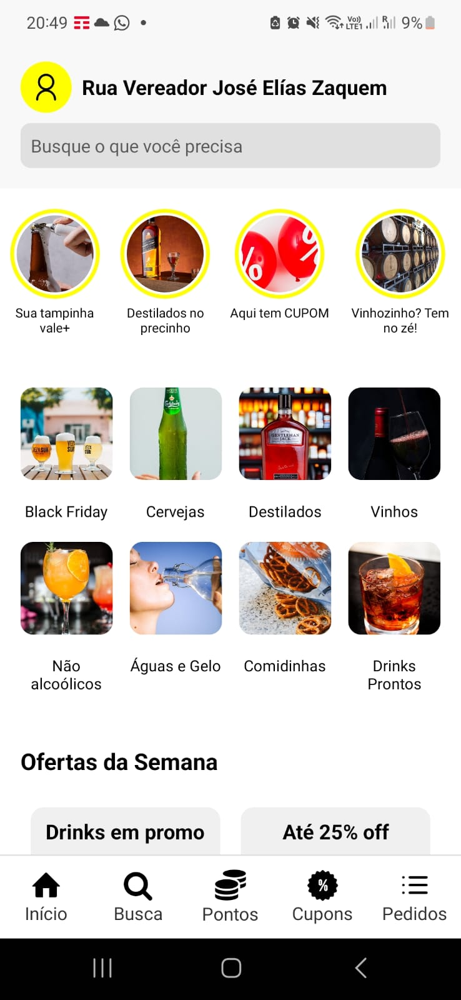
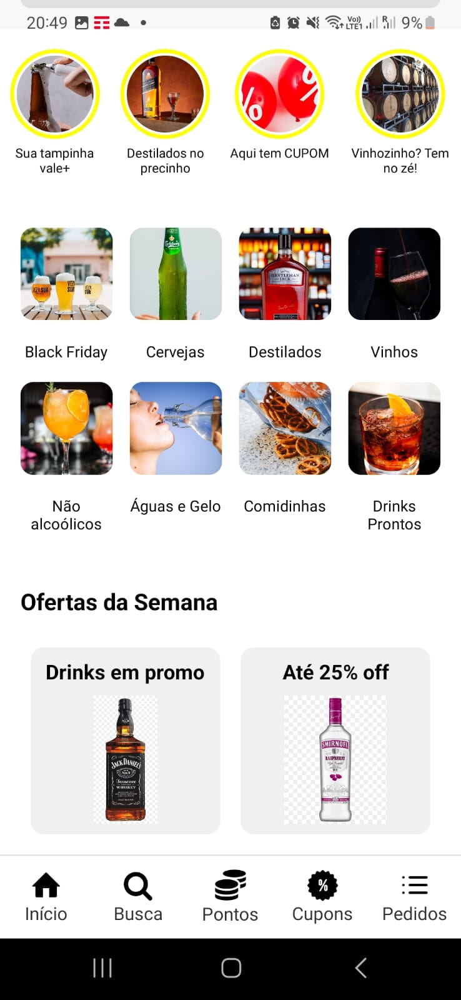

# Projeto de Desenvolvimento de Aplicativo Mobile

## Autor

- Rafael Labanca Guberman
- [LinkedIn](https://www.linkedin.com/in/rafael-guberman-2486a1ba/)

## Desafio

O desafio consistia em clonar uma tela da minha escolha. A tela não precisava ter a implementação das funcionalidades, basta replicar o layout.
Eu escolhi copiar a tela de Home do app Zé Delivery.

## Tecnologias Utilizadas

- **Visual Studio Code**: Ambiente de desenvolvimento.
- **TypeScript**: Linguagem utilizada para o desenvolvimento.
- **React Native**: Framework para desenvolvimento de aplicativos mobile.

## Telas do Projeto

### Tela Clonada

### Telas Criadas

#### Minha tela

#### com Scroll

